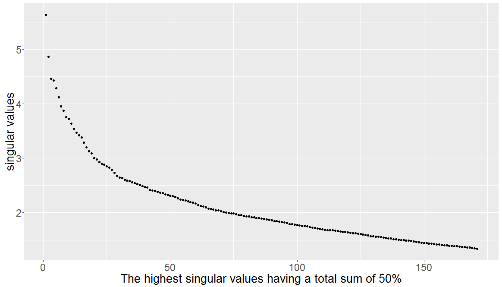
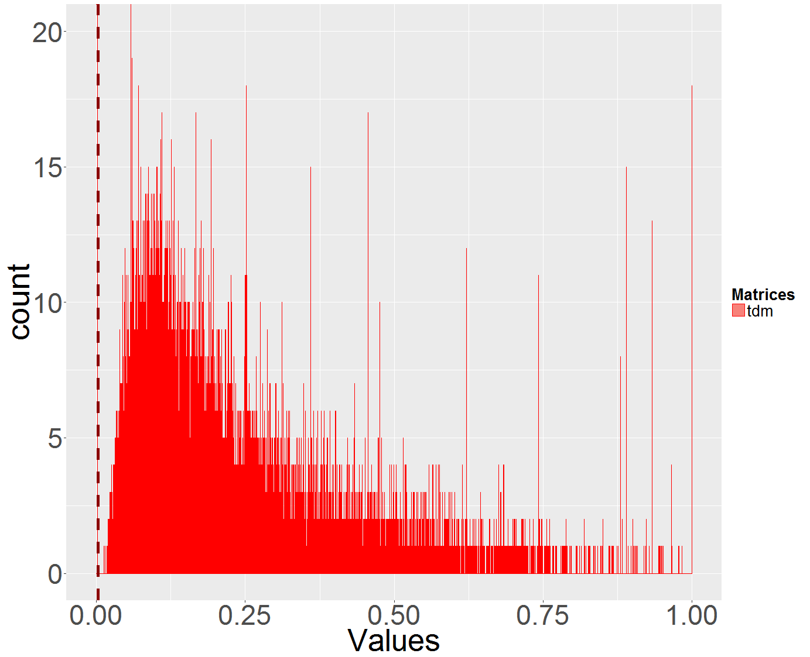

[](http://quantlet.de/)

## [](http://quantlet.de/) **LSA_basics** [](http://quantlet.de/)

```yaml

Name of Quantlet : LSA_basics

Published in : Q3-D3-LSA

Description : 'Plots the highest singular values as provided by the LSA process for the given term
document matrix TDM of the Quantlets. Additionally, the histogram of the matrix values in the TDM
is plotted via ggplot2 package. The high sparsity of the TDM becomes evident. The mean value is
indicated via a dashed vertical line.'

Keywords : 'data mining, text mining, term document matrix, quantnet, lsa, svd,
descriptive-statistics, singular values, plot, histogram, ggplot2'

See also : LSA_kernel, LSA_basics_hist_box, LSA_heatmaps_factors, LSA_heatmaps_sum, LSA_PC_rotation

Author : Lukas Borke

Submitted : 31.10.2016 by Lukas Borke

Example: 
- 1: Plot of the highest singular values
- 2: Histogram of the matrix values in the TDM

```






### R Code:
```r

# Clear all variables
rm(list = ls(all = TRUE))
graphics.off()

# Install and load packages
libraries = c("lsa", "ggplot2", "plyr")
lapply(libraries, function(x) if (!(x %in% installed.packages())) {
  install.packages(x)
})
lapply(libraries, library, quietly = TRUE, character.only = TRUE)


(obj.names = load("TDM_Q3D3LSA.RData", .GlobalEnv))


# LSA space creation

system.time( LSA_space <- lsa(m_a) )
summary(LSA_space)

# Tests and experiments with SVD
U   = LSA_space$tk
V   = LSA_space$dk
sv  = LSA_space$sk

dim(m_a)
dim(U)
dim(V)
length(sv)

# Check that the rows of the right matrix of SVD (rows of t(V) = Docs Coefficients to a PC) are normalized to 1
rowSums(t(V)^2)

# Check that columnns of U are normalized to 1
colSums(U^2)


#------------------------------------------------
# Plot the highest singular values having a total sum of 50%: a default parametrization given by LSA_space <- lsa(m_a)
#------------------------------------------------

# Effect of the singular values i.e. their weights

x_axis = 1:length(LSA_space$sk)

#qp <- qplot(x_axis, LSA_space$sk, xlab = "", ylab = "singular values")

qp <- qplot(x_axis, LSA_space$sk, xlab = "The highest singular values having a total sum of 50%", ylab = "singular values")
qp + theme(axis.text = element_text(size = 17), axis.title = element_text(size = 20))


#------------------------------------------------
# TDK - Histogram of the matrix values in TDM (basis VSM)
#------------------------------------------------

# convert the TDM to a vector
m_v = as.vector(m_a)

summary(m_v)

# Sparsity of TDM (basis VSM)
length(m_v[m_v > 0])
length(m_v)
length(m_v[m_v > 0]) / length(m_v)
length(m_v[m_v == 0]) / length(m_v)


# collect all data in a data frame for ggplot representation
datTDM <- data.frame(
	Matrices = factor(rep(c("tdm"), each = length(m_v))),
	Values = c(m_v)
)

cdatTDM <- ddply(datTDM, "Matrices", summarise, Values.mean=mean(Values), Values.median=median(Values))
cdatTDM

# ggplot
dev.new(width = 16, height = 13)

ggplot(datTDM, aes(x = Values, fill = Matrices)) + coord_cartesian(xlim = c(0,1), ylim = c(0,20)) + 
	geom_histogram(binwidth = .0001, alpha = .9, position = "identity", colour = "red") + 
	geom_vline(data = cdatTDM, aes(xintercept = Values.mean), linetype = "dashed", size = 2, colour = "darkred") +
	theme(axis.text = element_text(size = 35), axis.title = element_text(size = 40)) +
	theme(legend.title = element_text(size = 20, face = "bold"), legend.text = element_text(size=20))


```
