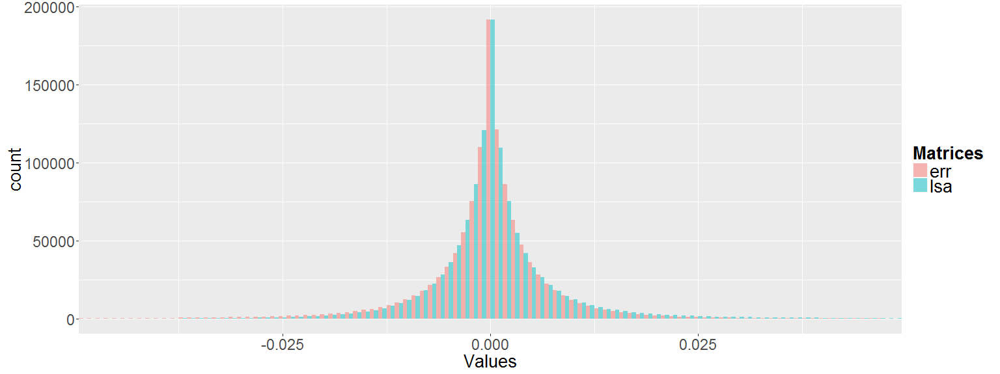
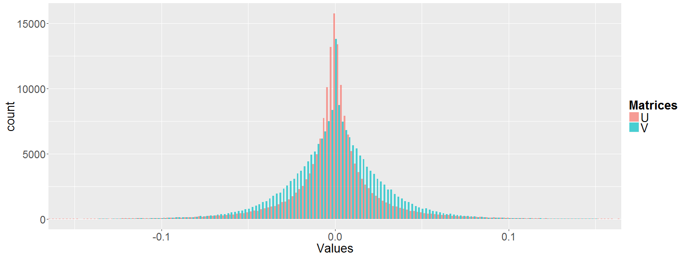
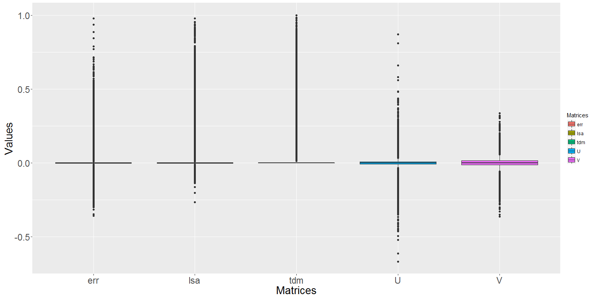

[](http://quantlet.de/)

## [](http://quantlet.de/) **LSA_basics_hist_box** [](http://quantlet.de/)

```yaml

Name of Quantlet : LSA_basics_hist_box

Published in : Q3-D3-LSA

Description : 'The SVD factor matrices U, V and the resulting LSA matrices m_lsa and error_matrix
from the LSA process are extracted and calculated. The LSA process is applied on the term document
matrix TDM of the Quantlets. Their histograms and boxplots are displayed using ggplot :
Implementation of the Grammar of Graphics in R.'

Keywords : 'data mining, text mining, term document matrix, quantnet, lsa, svd,
descriptive-statistics, boxplot, histogram, ggplot2'

See also : LSA_kernel, LSA_basics, LSA_heatmaps_factors, LSA_heatmaps_sum, LSA_PC_rotation

Author : Lukas Borke

Submitted : 31.10.2016 by Lukas Borke

Example: 
- 1: Histogram of the matrix values in the LSA matrices m_lsa and error_matrix
- 2: Histogram of SVD factor matrices U, V
- 3: 'Boxplot of all calculated matrices: TDM, U, V, m_lsa and error_matrix'

```








### R Code:
```r

# Clear all variables
rm(list = ls(all = TRUE))
graphics.off()

# Install and load packages
libraries = c("lsa", "ggplot2", "plyr")
lapply(libraries, function(x) if (!(x %in% installed.packages())) {
  install.packages(x)
})
lapply(libraries, library, quietly = TRUE, character.only = TRUE)


(obj.names = load("TDM_Q3D3LSA.RData", .GlobalEnv))


# LSA space creation

system.time( LSA_space <- lsa(m_a) )
summary(LSA_space)

# Extract SVD factors
U   = LSA_space$tk
V   = LSA_space$dk

# m_lsa = as.textmatrix(LSA_space)
m_lsa = as.matrix(as.textmatrix(LSA_space))
# For comparison, errors in matrix form (LSA approximation error)
error_matrix = m_a - m_lsa

dim(m_a)
dim(m_lsa)
dim(error_matrix)

# convert the TDM to a vector
m_v 	= as.vector(m_a)
m_lsa_v = as.vector(m_lsa)
m_err_v = as.vector(error_matrix)

m_U_v 	= as.vector(U)
m_V_v 	= as.vector(V)


#------------------------------------------------
# Histogram of the matrix values in ...
#------------------------------------------------

# D_k, D_err
# collect all data in a data frame for ggplot representation
datLSA = data.frame(
	Matrices = factor(rep(c("err", "lsa"), each=length(m_v))),
	Values   = c(m_err_v, m_lsa_v)
)

cdatLSA = ddply(datLSA, "Matrices", summarise, Values.mean=mean(Values), Values.median=median(Values))
cdatLSA

dev.new(width=16, height=6)

ggplot(datLSA, aes(x = Values, fill = Matrices)) + coord_cartesian(xlim = c(-0.045, 0.045)) + 
	geom_histogram(binwidth = .001, alpha = .5, position = "dodge") + 
	theme(axis.text = element_text(size = 17), axis.title = element_text(size = 20)) +
	theme(legend.title = element_text(size = 20, face = "bold"), legend.text = element_text(size = 20))


# U, V
dat_UV = data.frame(
	Matrices = factor(c(rep("U", length(m_U_v)), rep("V", length(m_V_v)))),
	Values = c(m_U_v, m_V_v)
)

cdatUV = ddply(dat_UV, "Matrices", summarise, Values.mean=mean(Values), Values.median=median(Values))
cdatUV

dev.new(width=16, height=6)

ggplot(dat_UV, aes(x = Values, fill = Matrices)) + coord_cartesian(xlim = c(-0.15, 0.15)) + 
	geom_histogram(binwidth = .002, alpha = .7, position = "dodge") + 
	theme(axis.text = element_text(size = 17), axis.title = element_text(size = 20)) +
	theme(legend.title = element_text(size = 20, face = "bold"), legend.text = element_text(size = 20))

	
# All matrices

dat_full = data.frame(
	Matrices = factor(c(rep(c("tdm", "lsa", "err"), each=length(m_v)),
						rep("U", length(m_U_v)),
						rep("V", length(m_V_v))
						),
					 ), 
	Values = c(m_v, m_lsa_v, m_err_v, m_U_v, m_V_v)
)

# boxplot
dev.new(width=16, height=8)

ggplot(dat_full, aes(x = Matrices, y = Values, fill = Matrices)) + geom_boxplot() + 
	theme(axis.text = element_text(size = 17), axis.title = element_text(size = 20))


```
