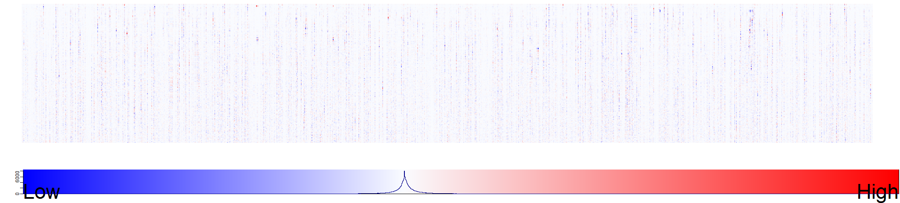
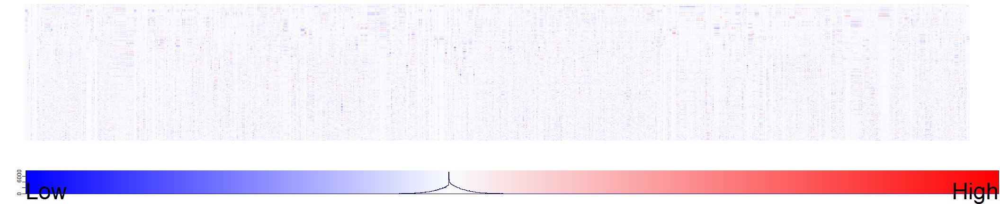
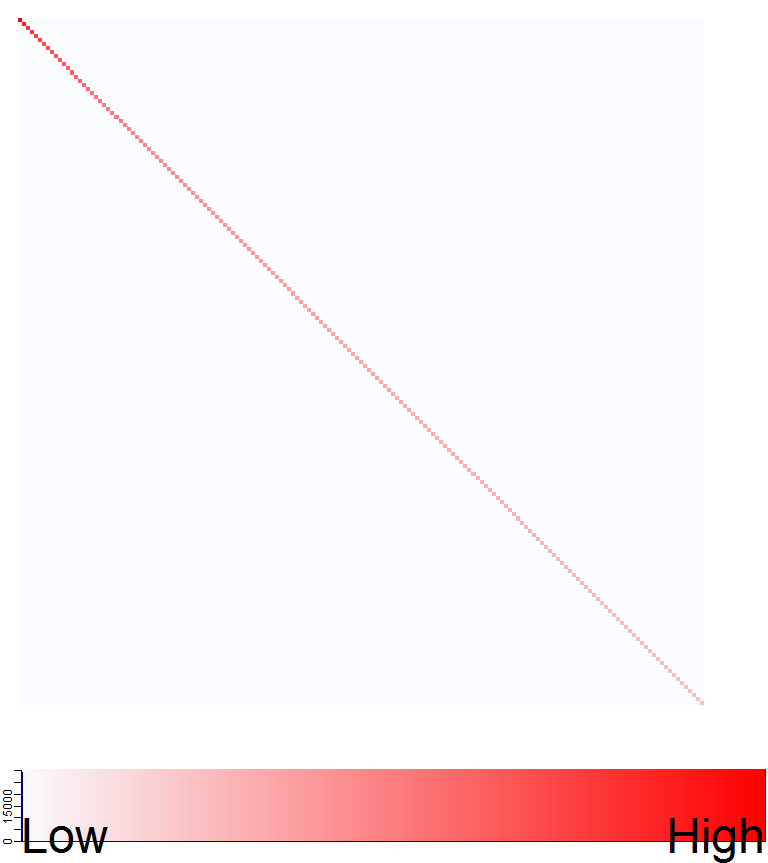

[](http://quantlet.de/)

## [](http://quantlet.de/) **LSA_heatmaps_factors** [](http://quantlet.de/)

```yaml

Name of Quantlet : LSA_heatmaps_factors

Published in : Q3-D3-LSA

Description : 'Big Data visualization of LSA via heat maps. Heat maps with color key of the LSA
decomposition matrices are produced via gplots package. The truncated SVD factor matrices U, V and
d_s (diagonal Sigma matrix) are extracted from the LSA space. The LSA process is applied on the
term document matrix TDM of the Quantlets.'

Keywords : 'data mining, text mining, term document matrix, quantnet, lsa, svd,
descriptive-statistics, heat map, visualization'

See also : LSA_kernel, LSA_basics, LSA_heatmaps_sum, LSA_basics_hist_box, LSA_PC_rotation

Author : Lukas Borke

Submitted : 31.10.2016 by Lukas Borke

Example: 
- 1: Heat map of U
- 2: Heat map of V
- 3: Heat map of d_s (diagonal Sigma matrix)

```








### R Code:
```r

# Clear all variables
rm(list = ls(all = TRUE))
graphics.off()

# Install and load packages
libraries = c("lsa", "gplots")
lapply(libraries, function(x) if (!(x %in% installed.packages())) {
  install.packages(x)
})
lapply(libraries, library, quietly = TRUE, character.only = TRUE)


(obj.names = load("TDM_Q3D3LSA.RData", .GlobalEnv))


# LSA space creation

system.time( LSA_space <- lsa(m_a) )
summary(LSA_space)


# Extract SVD factors
U   = LSA_space$tk
V   = LSA_space$dk
sv  = LSA_space$sk
# Diagonal matrix of singular values
d_s = diag(sv, length(sv), length(sv))


###
# Big Data visualization of LSA via Heatmap
# Heatmap of LSA matrices

my_palette_lsa_U_V = colorRampPalette(c("blue", rgb(0.98, 0.99, 1), "red"))(n = 2000)
col_breaks_lsa_U_V = c(
	seq(-0.67, 0, length = 1001),
	seq(0.001, 0.87, length = 1000)
)

my_palette_white_red = colorRampPalette(c(rgb(0.98, 0.99, 1), "red"))(n = 800)
col_breaks_white_red_diag = seq(0, 5.63, length = 801)

simpleTick_LowHigh = function() {
	#cex <- par("cex")*par("cex.axis")
	cex  = 3
	side = 1
	line = 0
	col  = par("col.axis")
	font = par("font.axis")
	mtext("Low",  side=side, at=0, adj=0, line=line, cex=cex, col=col, font=font)
	mtext("High", side=side, at=1, adj=1, line=line, cex=cex, col=col, font=font)
	return(list(labels=FALSE, tick=FALSE))
}


# U SVD

dev.new(width = 22, height = 5)

heatmap.2(t(U),
	trace = "none", revC = FALSE, dendrogram = "none", labRow = FALSE, labCol = FALSE, Rowv = FALSE, Colv = FALSE,
	symkey = FALSE, denscol = "darkblue", key.title = NA, key.xlab = NA, key.ylab = NA,
	key.par = list(mgp = c(0.5, 0.5, 0), mar = c(1.5, 0.2, 0, 0.2)),
	col = my_palette_lsa_U_V, breaks = col_breaks_lsa_U_V,
	lmat = rbind(c(0,3), c(2,1), c(0,4)), lwid = c(0.1, 4), lhei = c(0.1, 4, 0.8),
	key.xtickfun = simpleTick_LowHigh
)


# V SVD

dev.new(width = 22, height = 4.5)

heatmap.2(t(V),
	trace = "none", revC = FALSE, dendrogram = "none", labRow = FALSE, labCol = FALSE, Rowv = FALSE, Colv = FALSE,
	symkey = FALSE, denscol = "darkblue", key.title = NA, key.xlab = NA, key.ylab = NA,
	key.par = list(mgp = c(0.5, 0.5, 0), mar = c(1.5, 0.2, 0, 0.2)),
	col = my_palette_lsa_U_V, breaks = col_breaks_lsa_U_V,
	lmat = rbind(c(0,3), c(2,1), c(0,4)), lwid = c(0.1, 4), lhei = c(0.1, 4, 0.8),
	key.xtickfun = simpleTick_LowHigh
)


# Diag Sigma

dev.new(width=8, height=9)

heatmap.2(d_s,
	trace = "none", revC = FALSE, dendrogram = "none", labRow = FALSE, labCol = FALSE, Rowv = FALSE, Colv = FALSE,
	symkey = FALSE, denscol = "darkblue", key.title = NA, key.xlab = NA, key.ylab = NA,
	key.par = list(mgp = c(0.5, 0.5, 0), mar = c(1.5, 0.2, 0, 0.2)),
	col = my_palette_white_red, breaks = col_breaks_white_red_diag,
	lmat = rbind(c(0,3), c(2,1), c(0,4)), lwid = c(0.1, 4), lhei = c(0.1, 4, 0.5),
	key.xtickfun = simpleTick_LowHigh
)


```
