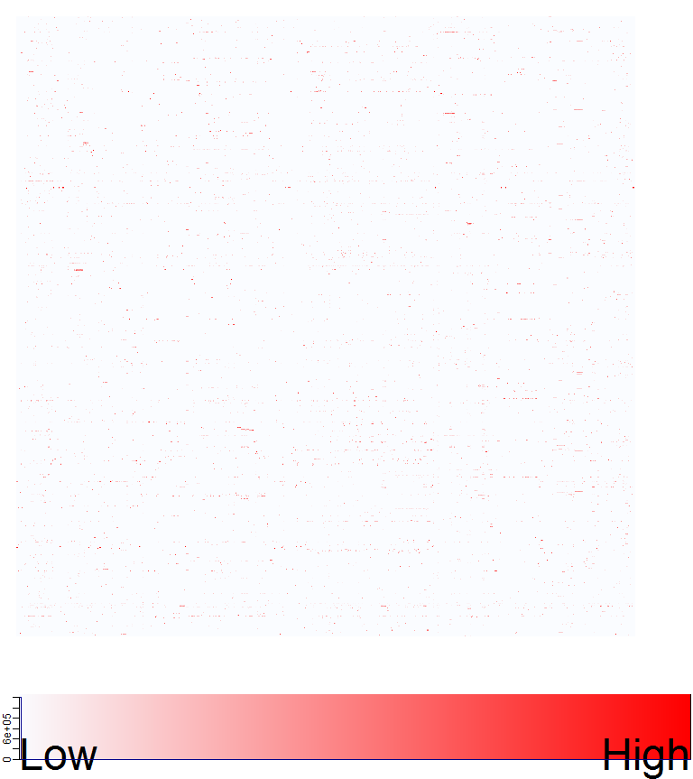
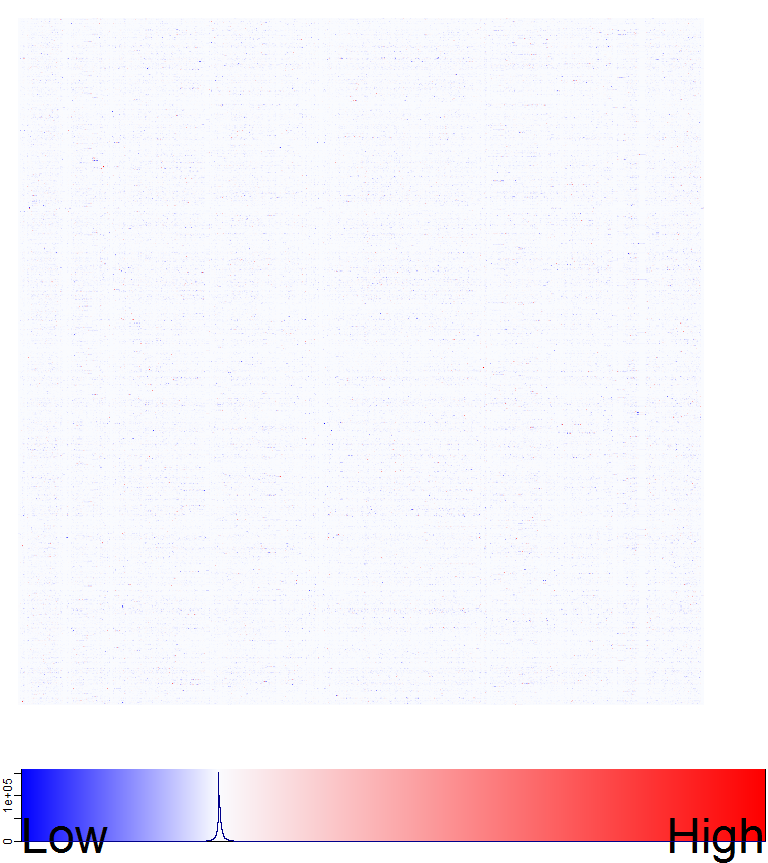

[](http://quantlet.de/)

## [](http://quantlet.de/) **LSA_heatmaps_sum** [](http://quantlet.de/)

```yaml

Name of Quantlet : LSA_heatmaps_sum

Published in : Q3-D3-LSA

Description : 'Big Data visualization of LSA via heat maps. Heat maps with color key of the LSA
decomposition matrices are produced via gplots package. m_a is the original term document matrix
TDM (BVSM) containing Quantlets, m_lsa the corresponding representation in the LSA model reduced to
the first k dimensions and error_matrix is the approximation error matrix of the SVD truncation.'

Keywords : 'data mining, text mining, term document matrix, quantnet, lsa, svd,
descriptive-statistics, heat map, visualization'

See also : LSA_kernel, LSA_basics, LSA_heatmaps_factors, LSA_basics_hist_box, LSA_PC_rotation

Author : Lukas Borke

Submitted : 31.10.2016 by Lukas Borke

Example: 
- 1: Heat map of m_a
- 2: Heat map of m_lsa
- 3: Heat map of error_matrix

```







### R Code:
```r

# Clear all variables
rm(list = ls(all = TRUE))
graphics.off()

# Install and load packages
libraries = c("lsa", "gplots")
lapply(libraries, function(x) if (!(x %in% installed.packages())) {
  install.packages(x)
})
lapply(libraries, library, quietly = TRUE, character.only = TRUE)


(obj.names = load("TDM_Q3D3LSA.RData", .GlobalEnv))


# LSA space creation

system.time( LSA_space <- lsa(m_a) )
summary(LSA_space)

# Calculation of truncated LSA TDM from SVD (the dimensions will vary depending on the current yaml data)
# m_lsa = as.textmatrix(LSA_space)
m_lsa = as.matrix(as.textmatrix(LSA_space))

# For comparison, errors in matrix form (LSA approximation error)
error_matrix = m_a - m_lsa

dim(m_a)
dim(m_lsa)
dim(error_matrix)


###
# Big Data visualization of LSA via Heatmap
# Heatmap of LSA matrices

my_palette_white_red2 = colorRampPalette(c(rgb(0.98, 0.99, 1), "red"))(n = 500)
col_breaks_white_red2 = seq(0, 1, length = 501)

my_palette_lsa3 = colorRampPalette(c("blue", rgb(0.98, 0.99, 1), "red"))(n = 2000)
col_breaks_lsa3 = c(
	#seq(-0.27, 0, length = 401),
	seq(-0.36, 0, length = 1001),
	seq(0.001, 1, length = 1000)
)

my_palette_err <- colorRampPalette(c("blue", rgb(0.98, 0.99, 1), "red"))(n = 2000)
col_breaks_err = c(
	seq(-0.36, 0, length = 1001),
	seq(0.001, 1, length = 1000)
)

simpleTick_LowHigh = function() {
	#cex <- par("cex")*par("cex.axis")
	cex  = 3
	side = 1
	line = 0
	col  = par("col.axis")
	font = par("font.axis")
	mtext("Low",  side=side, at=0, adj=0, line=line, cex=cex, col=col, font=font)
	mtext("High", side=side, at=1, adj=1, line=line, cex=cex, col=col, font=font)
	return(list(labels=FALSE, tick=FALSE))
}


# TDM matrix

dev.new(width = 8, height = 9)

heatmap.2(m_a,
	trace = "none", revC = FALSE, dendrogram = "none", labRow = FALSE, labCol = FALSE, Rowv = FALSE, Colv = FALSE,
	symkey = FALSE, denscol = "darkblue", key.title = NA, key.xlab = NA, key.ylab = NA,
	key.par = list(mgp = c(0.5, 0.5, 0), mar = c(1.5, 0.2, 0, 0.2)),
	col = my_palette_white_red2, breaks = col_breaks_white_red2,
	lmat = rbind(c(0,3), c(2,1), c(0,4)), lwid = c(0.1, 4), lhei = c(0.1, 4, 0.5),
	key.xtickfun = simpleTick_LowHigh
)


# lsa matrix

dev.new(width = 8, height = 9)

heatmap.2(m_lsa,
	trace = "none", revC = FALSE, dendrogram = "none", labRow = FALSE, labCol = FALSE, Rowv = FALSE, Colv = FALSE,
	symkey = FALSE, denscol = "darkblue", key.title = NA, key.xlab = NA, key.ylab = NA,
	key.par = list(mgp = c(0.5, 0.5, 0), mar = c(1.5, 0.2, 0, 0.2)),
	col = my_palette_lsa3, breaks = col_breaks_lsa3,
	lmat = rbind(c(0,3), c(2,1), c(0,4)), lwid = c(0.1, 4), lhei = c(0.1, 4, 0.5),
	key.xtickfun = simpleTick_LowHigh
)


# error matrix

dev.new(width = 8, height = 9)

heatmap.2(error_matrix,
	trace = "none", revC = FALSE, dendrogram = "none", labRow = FALSE, labCol = FALSE, Rowv = FALSE, Colv = FALSE,
	symkey = FALSE, denscol = "darkblue", key.title = NA, key.xlab = NA, key.ylab = NA,
	key.par = list(mgp = c(0.5, 0.5, 0), mar = c(1.5, 0.2, 0, 0.2)),
	col = my_palette_err, breaks = col_breaks_err,
	lmat = rbind(c(0,3), c(2,1), c(0,4)), lwid = c(0.1, 4), lhei = c(0.1, 4, 0.5),
	key.xtickfun = simpleTick_LowHigh
)

```
