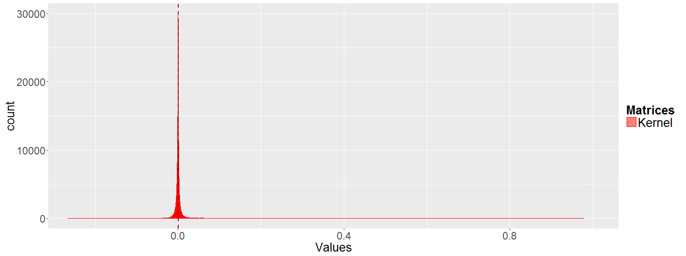
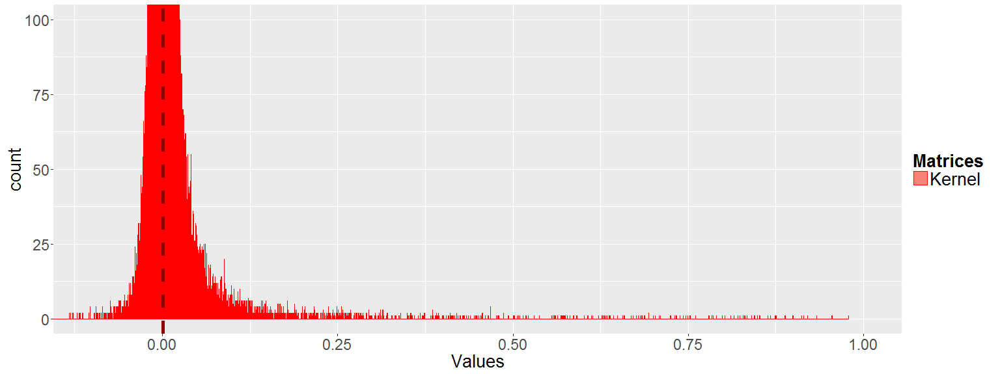
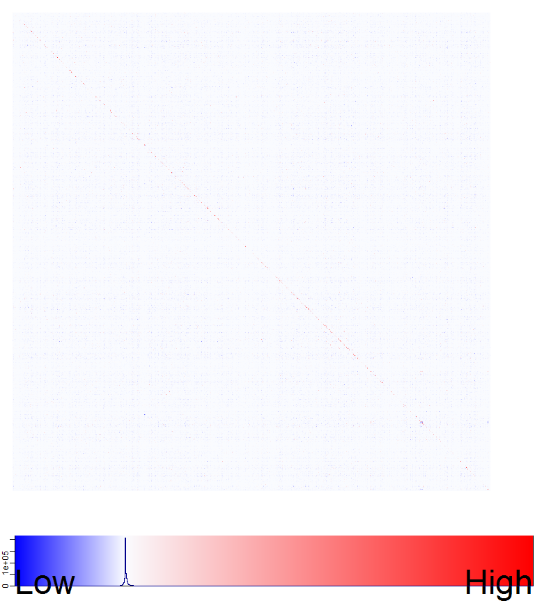
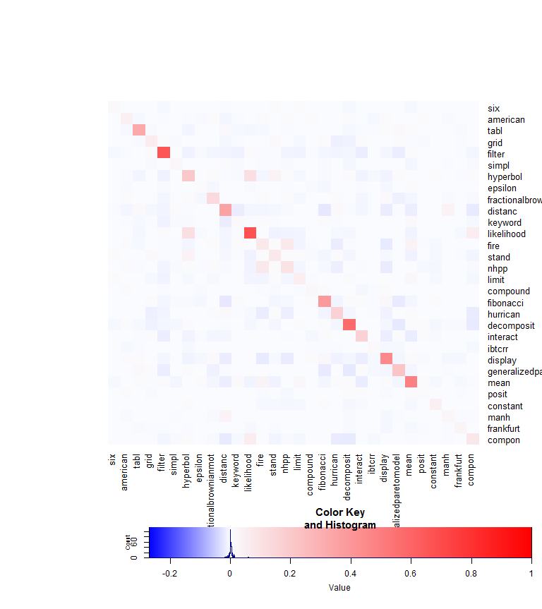
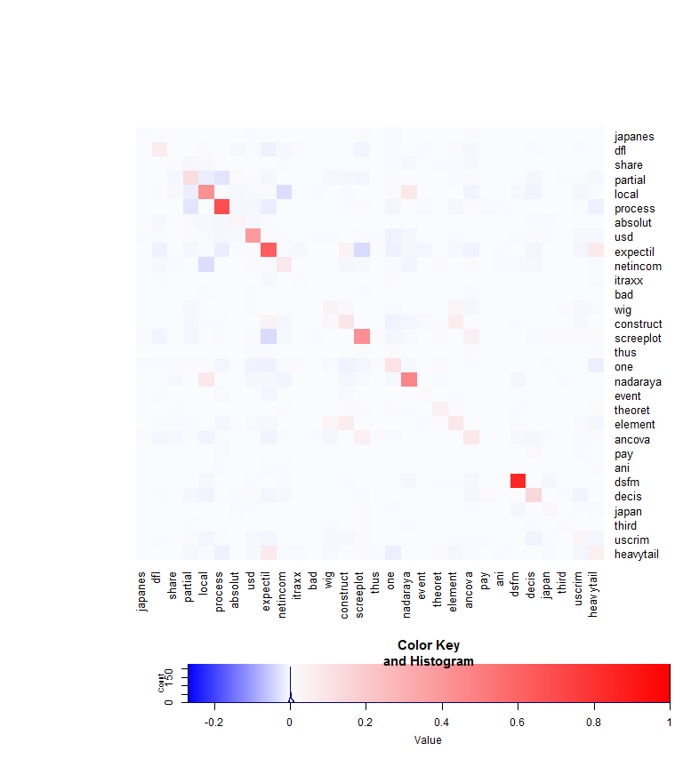

[](http://quantlet.de/)

## [](http://quantlet.de/) **LSA_kernel** [](http://quantlet.de/)

```yaml

Name of Quantlet : LSA_kernel

Published in : Q3-D3-LSA

Description : 'Big Data visualization of LSA via heat maps. The LSA process is applied on the term
document matrix TDM of the Quantlets. Heat maps with color key of the semantic kernel and its
subsets are produced via gplots package. The semantic kernel U_kernel is extracted from the LSA
space. For demonstration purpose some sub matrices are taken from the full semantic kernel allowing
the exact determination of "semantically correlated" term pairs. Additionally, histograms of the
semantic kernel values are plotted via ggplot2 package from different aspects.'

Keywords : 'data mining, text mining, term document matrix, quantnet, lsa, svd,
descriptive-statistics, correlation, heat map, visualization, histogram, semantic kernel, ggplot2'

See also : LSA_heatmaps_factors, LSA_basics, LSA_heatmaps_sum, LSA_basics_hist_box, LSA_PC_rotation

Author : Lukas Borke

Submitted : 31.10.2016 by Lukas Borke

Example: 
- 1: Histogram of the semantic kernel (full)
- 2: Histogram of the semantic kernel (zoomed)
- 3: Heat map of the full semantic kernel
- 4: Heat map of a randomly chosen 30 x 30 sub matrix of the semantic kernel (with term labels)
- 5: Heat map of a randomly chosen 30 x 30 sub matrix of the semantic kernel (with term labels)
- 6: Heat map of a randomly chosen 30 x 30 sub matrix of the semantic kernel (with term labels)

```












### R Code:
```r

# Clear all variables
rm(list = ls(all = TRUE))
graphics.off()

# Install and load packages
libraries = c("lsa", "gplots", "ggplot2", "plyr")
lapply(libraries, function(x) if (!(x %in% installed.packages())) {
  install.packages(x)
})
lapply(libraries, library, quietly = TRUE, character.only = TRUE)


(obj.names = load("TDM_Q3D3LSA.RData", .GlobalEnv))


# LSA space creation

system.time( LSA_space <- lsa(m_a) )
summary(LSA_space)


# Extract SVD factors
U = LSA_space$tk

# semantic kernel
U_kernel = U %*% t(U)


## Histogram via ggplot2

m_Ker_v = as.vector(U_kernel)

summary(m_Ker_v)

# m_Ker_v
# collect all data in a data frame for ggplot representation
datKer = data.frame(
	Matrices = factor(rep(c("Kernel"), each=length(m_Ker_v))),
	Values = c(m_Ker_v)
)

cdatKer = ddply(datKer, "Matrices", summarise, Values.mean = mean(Values), Values.median = median(Values))
cdatKer

dev.new(width = 16, height = 6)
# full
ggplot(datKer, aes(x = Values, fill = Matrices)) + coord_cartesian(xlim = c(-0.25,1)) + 
	geom_histogram(binwidth=.0001, alpha=.9, position="identity", colour="red") + 
	geom_vline(data=cdatKer, aes(xintercept=Values.mean), linetype="dashed", size=1, colour="darkred") +
	theme(axis.text = element_text(size = 17), axis.title = element_text(size = 20)) +
	theme(legend.title = element_text(size=20, face="bold"), legend.text = element_text(size=20))


dev.new(width = 16, height = 6)
# zoomed
ggplot(datKer, aes(x = Values, fill = Matrices)) + coord_cartesian(xlim = c(-0.1,1), ylim = c(0,100)) + 
	geom_histogram(binwidth=.0001, alpha=.9, position="identity", colour="red") + 
	geom_vline(data=cdatKer, aes(xintercept=Values.mean), linetype="dashed", size=2, colour="darkred") +
	theme(axis.text = element_text(size = 17), axis.title = element_text(size = 20)) +
	theme(legend.title = element_text(size=20, face="bold"), legend.text = element_text(size=20))


##
# Big Data visualization of LSA via Heatmap
# Heatmap of LSA matrices


my_palette_lsa_Ker = colorRampPalette(c("blue", rgb(0.98, 0.99, 1), "red"))(n = 2000)
col_breaks_lsa_Ker = c(
	seq(-0.27, 0, length = 1001),
	seq(0.001, 1, length = 1000)
)


simpleTick_LowHigh = function() {
	#cex <- par("cex")*par("cex.axis")
	cex  = 3
	side = 1
	line = 0
	col  = par("col.axis")
	font = par("font.axis")
	mtext("Low",  side=side, at=0, adj=0, line=line, cex=cex, col=col, font=font)
	mtext("High", side=side, at=1, adj=1, line=line, cex=cex, col=col, font=font)
	return(list(labels=FALSE, tick=FALSE))
}


# lsa Kernel

dev.new(width = 8, height = 9)

heatmap.2(U_kernel,
	trace = "none", revC = FALSE, dendrogram = "none", labRow = FALSE, labCol = FALSE, Rowv = FALSE, Colv = FALSE,
	symkey = FALSE, denscol = "darkblue", key.title = NA, key.xlab = NA, key.ylab = NA,
	key.par=list(mgp=c(0.5, 0.5, 0), mar=c(1.5, 0.2, 0, 0.2)),
	col = my_palette_lsa_Ker, breaks = col_breaks_lsa_Ker,
	lmat = rbind(c(0,3),c(2,1),c(0,4)), lwid = c(0.1,4), lhei = c(0.1,4,0.5),
	key.xtickfun = simpleTick_LowHigh
)


# Subset Kernel
m = 30
colnames(U_kernel) = rownames(m_a)

(sub_s = sample(nrow(U_kernel), m))

dev.new(width = 8, height = 9)
heatmap.2(U_kernel[sub_s,sub_s],
	trace = "none", revC = FALSE, dendrogram = "none", Rowv = FALSE, Colv = FALSE,
	symkey = FALSE, denscol = "darkblue",
	cexRow = 1.2, cexCol = 1.2, margins = c(7, 7),
	col = my_palette_lsa_Ker, breaks = col_breaks_lsa_Ker,
	lmat = rbind(c(0,3),c(2,1),c(0,4)), lwid = c(1,4), lhei = c(1,4,1)
)


```
